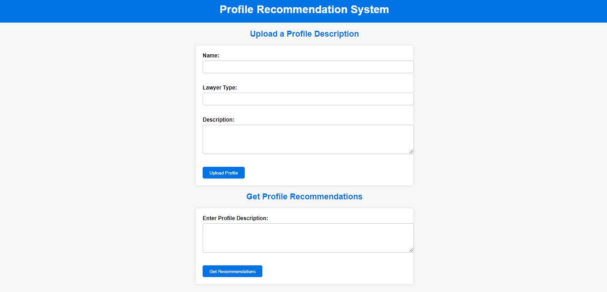

# Job-recommendation-System-using-BERT-model-in-Mysql-Database-using-Flask
This is job recommendation system where the job profiles are displayed as per the requirement of the client . This platform is made by using Flask framework of python using NLP by BERT Model
the profiles can be uploaded by admin/user in the MySQL database and if the requirement is given it will show the profile based on description in the interface from the MySQL DB using and understanding the requirement by BERT Model

## Some Snaps of the project

